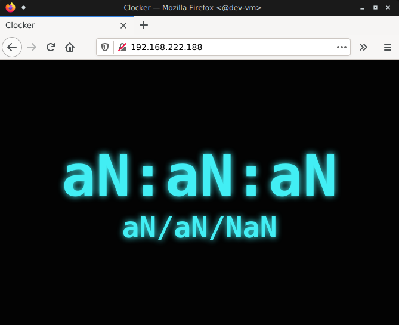
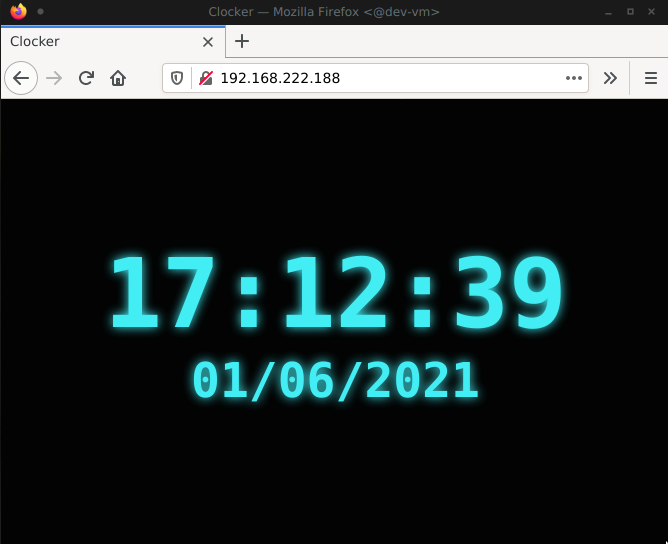

## 0. State of the test requeriments

- [X] Proper ansible project structure
- [X] Use docker to run ansible
- [X] Use ssh-agent inside ansible container
- [X] Run frontend and backend services using docker
- [X] Backend application configurable using environment variables
- [X] Don't run services as root
- [ ] Configure & deploy EVERYTHING using a single command, i.e: bash script

## 1. Virtual Machine Configuration

Context: We got an xml machine configuration for `libvirt` that runs a qemu virtual machine.  

NOTE: I'm working on ubuntu 20.04 LTS. I try to use the easiest way to install all the needs and for me is using the `apt`, `apt-get` or `snap`.  

### A. Instalation of needed programs  

As the xml are generated working with `qemu` I tried to recreate the envoirment the most similar and going to use `qemu`.  

The first thing to do is take a look if our computer is capable to do the virtualitzation. The command `vm-ok` will answer the question and will show something like this:

After this we can install `libvirt` and `qemu`:   

`sudo apt install qemu-kvm libvirt-daemon-system`

After this we can install `virt-manager` to have a visual reference of the machines that are running in our machine. In this case is not a great deal because our working image haven't desktop.

### B. Preparing the envoirment

Having all the tools to work with virtual machines, as the instructions provided tells to us we need to change the route where we have downloaded the SO image in or vm.xml.  

In my case I have downloaded to assets but to avoid any problem I have wrote the whole route in the path '/home/david/Projects/tech-test-infra/vm configuration/debian10-ssh.img.tar.xz'

### C. Running the Virtual Machine

After this the only thing we need to do to have our virtual machine running is call `virsh` giving the path of the vm.xml file. In this case I did the change directory (cd) until where vm.xml is stored and typed:
  
`virsh create vm.xml`  

### D. Some useful links for this part  

https://ubuntu.com/server/docs/virtualization-libvirt  

https://ubuntu.com/server/docs/virtualization-virt-tools#libvirt-virt-manager  

https://libvirt.org/  

## 2. Frontend Prepration

In front end I only need to modify the URL where clock goes to get the information. It goes from: 

`const CLOCK_URL = '/clock';`

to:

`const CLOCK_URL = 'http://localhost:5000/clock';`

Next step was creating dockerfile where the html will be executed in a server. I take a docker image with nginx and in the dockerfile copied the html to the directory where nginx stores the html to serve. This image having nginx has the port `80` opened and you can achieve the frontend.

## 2. Backend Prepration

### A. A little explanation

For backend I have created a simple flask app that serves on `host:5000\clock` a timestamp formated as string. You can change the port and the host in .env file and in the app this values are achieved from os envoirment. 

To dockerize this backend I take a docker image for flask that exposes the port `5000` and runs the app clock.

I have used poetry to manage dependencies.

### B. Some useful links for this part  

https://blog.doppler.com/environment-variables-in-python  

https://python-poetry.org/  

https://medium.com/thedevproject/start-using-env-for-your-flask-project-and-stop-using-environment-variables-for-development-247dc12468be  

https://www.api-ux.com/2022/02/16/como-crear-una-api-simple-con-python-flask-y-contenedores/  

## 3. Ansible Dockerized.

### A. Docker image configuration 

I taked a image of debian 11 to dockerize ansible. The dockerfile for this part has more configuration and I have to install python, ssh, and some more requeriments to lastly install ansible.

Installed ansible, next step is the configuration of the directories and copy the playbook into the docker image and some others files like hosts.

I have change the user to non-root user as you require.

As you tell in your requeriments in addition I have configured and imported the keys with ssh-agent in order to connect to the virtual machine via ssh.

### B. Ansible playbook preparation 

For the Ansible playbook I have made 3 documents:

1. Hosts: where the IP of all the hosts that need the changes are saved
2. vars.yml: where the data of the docker containers are stored in form of variables to make easy to change all.
3. playbook.yml: the main file of this part. After the configuration done in the dockerfile file of this part, here ansible does the changes in the hosts. The first change is install aptitude, next the requeriments to use docker, and lastly installs docker. After this as we have the dockerfile of frontend and backend ready, only have to copy, deploy and launch it in the host.

## 4. OPS! We're in a diferents nets?

### A. Facing the disaster

I tried to connect to te machine via console on virsh but it wasn't configurated. Next step was try to create a tunnel between my PC and the given machine. But after take a look to a good bunch of tutos It didn't goes to any way (I learned a lot about iptables and ufw but not enough it seems).

In this point I have got two options:

1. Touch the vm configuration xml. I avoided to do it because I don't Know anything about the services that the vm machine have running inside.
2. Create a new machine (ubuntu-mate) in the same virtual net sapce.

I take the 2 option because I suposed that another machine have to run ansible docker to deploy the playbook. In addition it gives us a machine to act as "CONTROLLER" for further and more complex ansible deployments.

I prefered to manage to create a tunnel or a bridge connection with the given vm but most of the solution I have read implies modify the xml and I'm not sure about make further modifications on the xml that are not indicated on the instructions.

### B. Deploying the Ubuntu Mate helper

I have deployed inside the same domain an image of Ubuntu Mate. My thought is that this image could be a "controller" with ansible and in addition don't need to be running if we don't need to change anything. It has some benefits because the chances of changes in the machine are low and it helps to mantain the connections and configurations.

### C. A surprise to be sure but NOT a welcome one

Deployed Ubuntu image I tried to connect to the immfly-debian10 image... But a unreacheable host is the response.

## 5. Next Steps: Young Fool. Only Now, At The End, Do You Understand.

When I talked with Ezequiel he gives me an advice: " If you got any problem don't stuck on it, ask us for help". After all I got the problem, I have got stucked with the connection to the image, but I don't realize after I'm very advanced on the project.

But It seems that the moment has arrived. HELP!

----  
    
# ORIGINAL PETITION

## Immfly Infra Test

The goal of this test is to deploy a simple "clock" web application (frontend + backend) in a virtual machine using `ansible`.

### Assets provided

- `debian10-ssh.img.tar.xz`: Compressed disk image of a virtual machine. This can be [downloaded from this link](https://immfly-infra-technical-test.s3-eu-west-1.amazonaws.com/debian10-ssh.img.tar.xz)
- `vm.xml`: Virtual machine XML definition for `libvirt`
- `rsa`: Authorized RSA key for accessing the virtual machine
- `index.html`: Frontend clock application

**Note about the VM**:

- The virtual machine operating system is a Debian 10 with `openssh-server` and `python3` installed.
- It will try to configure it's network interface via `DHCP`.
- In order to boot the virtual machine, configure the domain file `${PATH_TO_VM_DISK_FILE}` at `assets/vm.xml` with the location where the virtual machine image was extracted.

~~~xml
    <disk type='file' device='disk'>
      <driver name='qemu' type='raw'/>
      <source file='${PATH_TO_VM_DISK_FILE}'/>  <!-- change this -->
      <backingStore/>
      <target dev='vda' bus='virtio'/>
      <alias name='virtio-disk0'/>
      <address type='pci' domain='0x0000' bus='0x04' slot='0x00' function='0x0'/>
    </disk>
~~~

### Frontend application

Frontend is periodically calling at `/clock` endpoint (`HTTP GET` at port `80`) to gather timestamp information from a backend that doesn't exists yet.

### Backend application

Backend should be responding at path `/clock` and returning a unix timestamp like:

~~~py
>>> import time
>>> print(time.time())
1622556914.9101567
~~~

## Requirements

- Implement backend service (using any language/tech you love... or hate)
- Use ansible to deploy frontend and backend services inside the virtual machine.

If everything works, that is how it should look when accessing the virtual machine at port `80`:

## Extra points

- Proper ansible project structure
- Use docker to run ansible
- Use ssh-agent inside ansible container
- Run frontend and backend services using docker
- Backend application configurable using environment variables
- Don't run services as root
- Configure & deploy **EVERYTHING** using a single command, i.e: bash script

## Deliverables

- A git repository with an ansible project, the backend application and all other scripts you needed.
- Documentation explaining:
  - How to setup the VM
  - How to run the playbooks
- Feedback: please, don't hesitate to write any thoughts you have about this test.

Send the repository url to `ezequiel.biavaschi@immfly.com`
